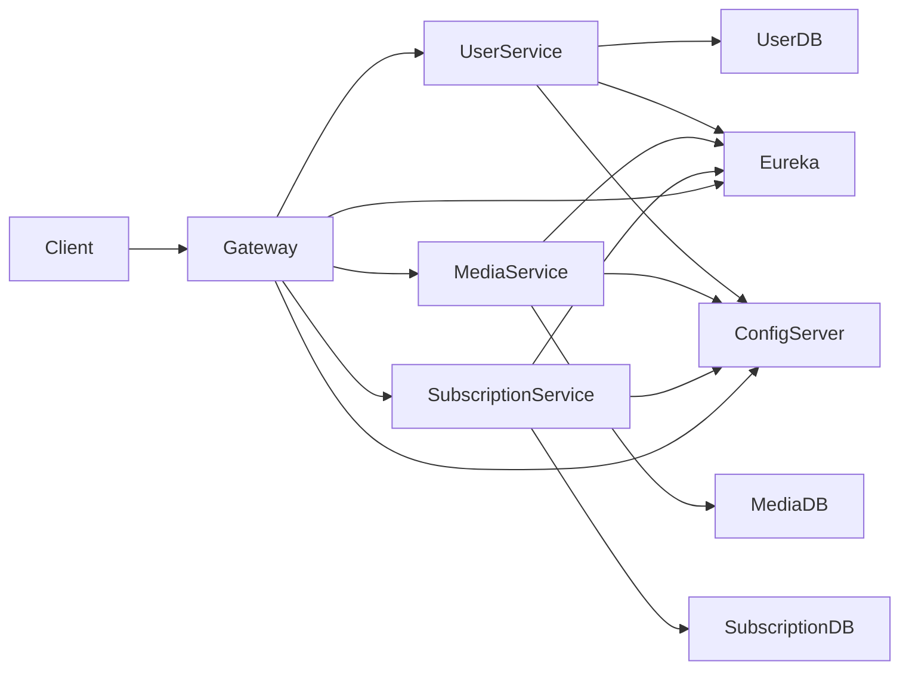

# MEDIAHUB — Organization Profile

**MEDIAHUB (2026)** is a distributed **microservices-based streaming platform** built using **Spring Cloud**.
The project simulates the architecture of a **production-grade streaming ecosystem**, emphasizing scalability, service isolation, and professional DevOps practices.

This organization serves as the **central coordination hub** for all repositories, workflows, infrastructure, and development standards.

---

# 🚀 MEDIAHUB Platform Overview

| Category                    | Technology                         |
| --------------------------- | ---------------------------------- |
| Language                    | **Java 17**                        |
| Framework                   | **Spring Boot 3.x / Spring Cloud** |
| Databases                   | **PostgreSQL (per service)**       |
| Service Discovery           | **Eureka**                         |
| Configuration               | **Spring Cloud Config Server**     |
| Inter-Service Communication | **OpenFeign**                      |
| API Entry Point             | **Spring Cloud Gateway**           |
| Containerization            | **Docker / Docker Compose**        |
| CI/CD                       | **GitHub Actions**                 |
| Architecture                | **Distributed Microservices**      |

---

# 📦 Organization Repositories

| Repository                      | Purpose                                           |
| ------------------------------- | ------------------------------------------------- |
| `mediahub-user-service`         | Authentication, user profiles, JWT security       |
| `mediahub-media-service`        | Media catalog, video metadata, search             |
| `mediahub-subscription-service` | Subscription plans, payments, user status         |
| `mediahub-gateway`              | Central API gateway and request routing           |
| `mediahub-eureka-server`        | Service discovery registry                        |
| `mediahub-config-server`        | Spring Cloud configuration server                 |
| `mediahub-config-repo`          | Centralized Git vault for all .yml config files   |
| `mediahub-infra`                | Docker infrastructure, databases, local network   |
| `.github`                       | Organization profile, templates, shared workflows |

Each repository has its **own lifecycle, CI pipeline, and maintainers**.

---

# 👥 Team Structure

| Member            | Role                    | Responsibility                               |
| ----------------- | ----------------------- | -------------------------------------------- |
| **Abdelmalek**    | Backend Dev             | Infrastructure, Gateway, Eureka, Security    |
| **Abdellatif**    | Backend Dev             | User Service (Authentication, JWT, Profiles) |
| **Fatimaezzahra** | Backend Dev             | Media Service (Video catalog, metadata)      |
| **Asmae**         | Backend Dev             | Subscription Service (Plans, payment logic)  |

Each engineer is the **guardian of their service repository**.

---

# 🌐 Network Mapping

| Service              | Port     | Description                        |
| -------------------- | -------- | ---------------------------------- |
| Eureka Server        | **8761** | Service registry/Discovery         |
| Config Server        | **8888** | Central configuration distribution |
| API Gateway          | **8080** | Public entry point                 |
| User Service         | **8081** | Authentication and user data       |
| Media Service        | **8082** | Video catalog and metadata         |
| Subscription Service | **8083** | Plans and subscription status      |
| PgAdmin              | **8090** | Database inspection UI             |

---

# 🧠 System Architecture Diagram

---

# 🧩 Local Development Workflow (Local-First)

Development follows a **local-first microservices approach** using Docker.

The **`mediahub-infra`** repository launches shared infrastructure.

### Services started via docker-compose

* Eureka Server
* PostgreSQL (3 instances)
* PgAdmin

### Databases

| Service              | Database          |HostPort|
| -------------------- | -------------------------- |
| User Service         | `user_db`         |  5432  |
| Media Service        | `media_db`        |  5433  |
| Subscription Service | `subscription_db` |  5434  |  

---

## Start the Local Network

```
git clone https://github.com/MEDIAHUB/mediahub-infra
cd mediahub-infra
docker compose up -d
```

This launches:

* PostgreSQL databases
* Adminer
* Shared Docker network

Microservices then run **locally from the IDE**.

---

# ⚡ Quick Start Guide

### 1. Clone your service repository

Example:

```
git clone https://github.com/MEDIAHUB/mediahub-user-service
```

### 2. Start infrastructure

```
cd mediahub-infra
docker compose up -d
```

### 3. Run core infrastructure services

Start **in this order**:

1. **Config Server**
2. **Eureka Server**
3. **API Gateway**
4. **Your Microservice**

### 4. Verify service registration

Open the Eureka dashboard:

```
http://localhost:8761
```

Your service must appear in the registry.

---

# 🏗 Development Architecture

Every microservice follows **strict layered architecture**.

```
Controller
   ↓
Service
   ↓
Repository
   ↓
Domain
```

Example project structure:

```
src/main/java/com/mediahub/userservice

controller/
service/
repository/
domain/
dto/
mapper/
config/
exception/
```

---

# 📡 API Standard

All REST controllers must return a **standardized response wrapper**.

```
public class ApiResponse<T> {

    private boolean success;
    private String message;
    private T data;

}
```

Example API response:

```
{
  "success": true,
  "message": "User created successfully",
  "data": {
    "id": 1,
    "email": "user@email.com"
  }
}
```

---

# 🔗 Inter-Service Communication

All service-to-service communication **must use OpenFeign**.

Example:

```
@FeignClient(name = "mediahub-user-service")
public interface UserClient {

    @GetMapping("/api/users/{id}")
    ApiResponse<UserDTO> getUser(@PathVariable Long id);

}
```

Rules:

* Use **service names registered in Eureka**
* Never hardcode URLs or ports

Wrong:

```
http://localhost:8081
```

Correct:

```
mediahub-user-service
```

---

# ⚙️ Configuration Strategy

All configuration is **centralized**.

Managed through:

```
mediahub-config-repo
```

Configuration flow:

```
Config Server
     ↓
Git Config Repository
     ↓
All Microservices
```

Secrets must be encrypted using:

```
{cipher}EncryptedValue
```

---

# 🤖 CI/CD Policy

Every repository contains **GitHub Actions pipelines**.

Pipelines validate:

* Project build
* Unit tests
* Code integrity

Merge condition:

**CI pipeline must be GREEN before merge.**

---

# 🔐 Branching Rules (Critical SOP)

Direct pushes to **`main`** are strictly forbidden.

Workflow:

```
main
  ↑
Pull Request
  ↑
feature/<name>/<task>
```

Example branch:

```
feature/abdellatif/jwt-authentication
```

Process:

1. Create feature branch
2. Push branch
3. Open Pull Request
4. CI pipeline runs
5. Peer review
6. Merge if approved

---

# 📜 Team Engineering Rules (The Contract)

### 1 — No Hardcoded URLs

Use **Eureka service names** only.

---

### 2 — Centralized Configuration

Secrets must never be committed directly.

---

### 3 — DTO Contract

If a **shared DTO changes**, notify the team immediately.

---

### 4 — Unified API Responses

All APIs must return **`ApiResponse<T>`**.

---

### 5 — CI/CD Integrity

If the pipeline fails:

Fix the build before requesting a merge.

---

### 6 — Pull Requests Only

No direct commits to **main**.

---

### 7 — Docker Proof

A service is considered **DONE** only when it runs correctly inside the **Docker network** with its database.

---

### 8 — Team Collaboration

If someone is blocked on:

* Docker
* Infrastructure
* Gateway
* Config Server

---

# 🎯 Project Mission

Deliver a **production-grade microservices streaming platform** in **14 days** with:

* Clean architecture
* Automated pipelines
* Service discovery
* Centralized configuration
* Dockerized infrastruct
